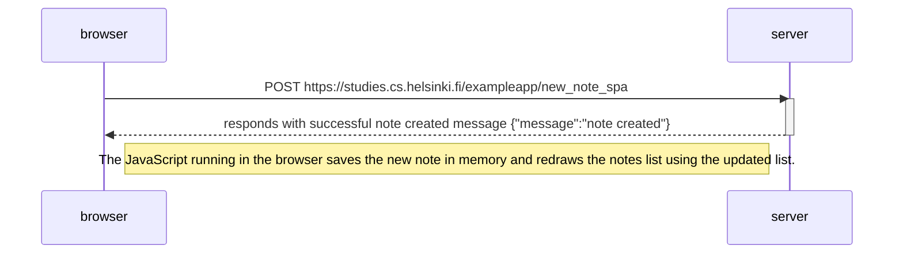

```mermaid
sequenceDiagram
    participant browser
    participant server

    browser->>server: POST https://studies.cs.helsinki.fi/exampleapp/new_note_spa
    activate server
    server-->>browser: responds with successful note created message {"message":"note created"}
    deactivate server

    Note right of browser: The JavaScript running in the browser saves the new note in memory and redraws the notes list using the updated list.
```
